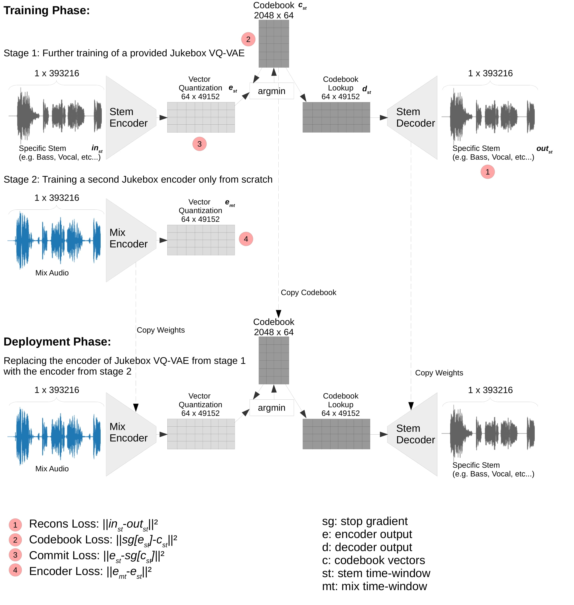

**Status:** Archive (code is provided as-is, no updates expected)

**Figure:** Visualization of the proposed transfer learning model architecture.



# PDF

**arXiv:** [Transfer Learning with Jukebox for Music Source Separation](https://arxiv.org/abs/2111.14200) <br />
**paperswithcode:** [Music Source Separation on MUSDB18-HQ](https://paperswithcode.com/sota/music-source-separation-on-musdb18-hq) <br />

# Unmix Disclaimer

This work is based on ["Jukebox: A Generative Model for Music"](https://arxiv.org/abs/2005.00341). We adjusted Jukebox for our application of demixing an audio signal into four different stems: drums, bass, vocals, other. This work was a part of the [ISMIR 2021 challange](https://www.aicrowd.com/challenges/music-demixing-challenge-ismir-2021).

# Install

Install the conda package manager from https://docs.conda.io/en/latest/miniconda.html

```
# Required: Sampling
conda create --name unmix python=3.7.5
conda activate unmix
conda install mpi4py=3.0.3 # if this fails, try: pip install mpi4py==3.0.3
conda install pytorch=1.4 torchvision=0.5 cudatoolkit=10.0 -c pytorch
git clone https://github.com/wzaiealmri/unmix.git
cd unmix
pip install -r requirements.txt
pip install -e .

# Required: Training
conda install av=7.0.01 -c conda-forge
pip install ./tensorboardX

# Optional: Apex for faster training with fused_adam
conda install pytorch=1.1 torchvision=0.3 cudatoolkit=10.0 -c pytorch
pip install -v --no-cache-dir --global-option="--cpp_ext" --global-option="--cuda_ext" ./apex
```

# Training

## Stage 1: VQVAE

To train the vqvae, run

```
mpiexec -n {ngpus} python unmix/train.py --hps=vqvae --name=vqvae_drums_b4 --sr=44100 --sample_length=393216 --bs=4 --audio_files_dir="Put the path to the specific stem audio folder" --labels=False --train --aug_shift --aug_blend
```

Here, `{audio_files_dir}` is the directory in which you can put the audio files for your stem , and `{ngpus}` is number of GPU's you want to use to train.
The above trains a one-level VQ-VAE with `downs_t = (3)`, and `strides_t = (2)` meaning we downsample the audio by `2**3 = 8` to get the first level of codes.  
Checkpoints are stored in the `logs` folder. You can monitor the training by running Tensorboard

```
tensorboard --logdir logs
```

## Stage 2: Encoder

### Train encoder

Once the VQ-VAE is trained, we can restore it from its saved checkpoint and train encoder on the learnt codes.
To train the encoder, we can run

```
mpiexec -n {ngpus} python unmix_encoder/train.py --hps=vqvae --name=encoder_drums__b4 --sr=44100 --sample_length=393216 --bs=4 --audio_files_dir="path to the mix dataset" --labels=False --train --aug_shift --aug_blend --encoder=True --channel=_1 --restore_vqvae="path to the specific checkpoint of the vq-vae"
```

# License (Jukebox OpenAI)

[Noncommercial Use License](./LICENSE)

It covers both released code and weights.

# Citation
```
@InProceedings{zai2022unmix,
author="Zai El Amri, Wadhah
and Tautz, Oliver
and Ritter, Helge
and Melnik, Andrew",
title="Transfer Learning with Jukebox for Music Source Separation",
booktitle="Artificial Intelligence Applications and Innovations",
year="2022",
publisher="Springer International Publishing",
pages="426--433",
isbn="978-3-031-08337-2"
}

```
